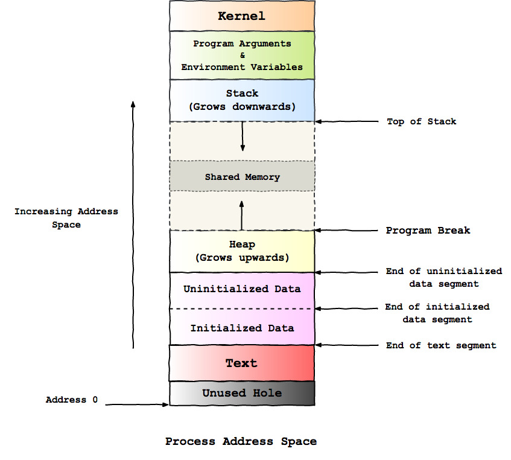

When you run a program, like the browser or the music player, the
kernel creates a _process_ to execute the program. The process borrows
memory from the operating system to run and the operating system ends
up creating what is known as the _process address space_. The
following diagram shows what this looks like:

<figure>
	
</figure>

Each brick is known as a _segment_. So let's see what each of these
mean:

- **Black brick** - This is an unused block of memory that is 2MB in
  size. If a program tries to access this segment a segmentation fault
  is generated and the kernel uses this to detect illegal memory access.

- **Red brick** - The text segment stores the program code that will
  be executed. This segment is made read only to prevent accidental
  modifications to its code by the process itself.

- **Pink brick** - The pink brick is the data segment and has two
  parts:

  - *Initialized data segment* - It stores all the variables declared
    in your program that are initialized with a value. For example, if
    your program has a line `int x = 5;`, it gets stored here.

  - *Uninitialized data segment* - It stores all the variables
    declared but not initialized with a value. For example, if your
    program has a line `int y;` it gets stored here.

  The data segment is created by reading the relevant variables from
  the program's executable. The unitialized variables can be grouped
  together and the memory allocation can be deferred to run time as and
  when required. The operating system informs the executable of the
  location of this memory segment and the size at the time of loading
  the program. The separation of the initialized and unitialized data
  segments helps in speeding up the memory allocation during process
  initialization.

- **Yellow brick** - The heap is the available memory that the program
  can use dynamically at run time. It starts at the memory address
  immediately where the data segment ends and is said to _grow
  upwards_ towards the grey brick (explained below). The last memory
  address of the heap is known as the _program break_. For example, if
  you create a linked list dynamically, your program utilizes the
  memory from this segment.

- **Blue brick** - The stack is the memory segment that is used
  whenever a new function call is made. It dynamically grows with each
  function call and shrinks once the function has returned. Each new
  entry added to the stack is known as a stack frame and stores the
  function arguments, the local variables and the return value. It is
  said to _grow downwards_ towards the grey brick (explained
  next). The top of the stack is known as the _stack pointer_ and the
  value of the memory address is smallest in the entire stack. As an
  optimization trick, when a function call returns the operating
  system does not deallocate the memory. Instead it simply changes the
  stack pointer to point to the previous memory block.

  A function (say _foo()_), uses a few CPU registers and when it calls
  another function (say _bar()_) they get copied onto the stack frame
  of _bar()_. And when _bar()_ returns, the register values are
  restored for _foo()_.

- **Grey brick** - This is a largely unallocated chunk of memory that
  the heap and the stack can utilize. Memory addresses are represented
  using hexadecimal numbers but to keep out discussion easy to follow
  we'll use integers here. The memory address is 0 at the beginning of
  the lowermost black brick and increases as we go upwards. For a
  given process the stack (blue brick) may begin at memory address 800
  and grow downwards upto memory address 700, while the heap (yellow
  brick) may begin at memory address 300 and grow upwards upto memory
  address 400. These numbers are not accurate but I hope it helps to
  drive the point home. Any shared memory maps or libraries are also
  placed in this block, but after leaving space for the heap to expand
  upwards and for the stack to expand downwards.

- **Green brick** - This section stores the environment variables and
  the arguments supplied to the program. For example, if you had a
  python script, _sum.py_ that accepts two numbers and print the sum
  you would possibly run it like: `python sum.py 3 4`. Here, `sum`,
  `3` and `4` are stored in this green segement. The `$PATH`
  environment variable, which is available to most programs is also
  stored here.

- **Orange brick** - The kernel is mapped onto this segment. When a
  program makes a system call a software interrupt is triggered and
  the execution mode does a context switch to gain additional
  privileges. After which the system call can be executed in the
  kernel space. This makes system calls slower than regular function
  calls. By mapping the kernel into the process's address space at the
  time of process creation, the operating system is able to remove the
  performance overhead when the system call is invoked.
